# 🏷 브랜드 & 상품 (Brands / Products)

## 1. 브랜드 정보 조회

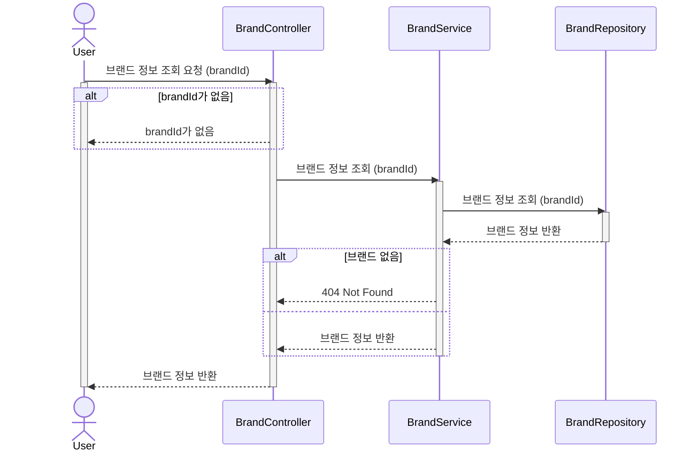

## 2. 상품 목록 조회

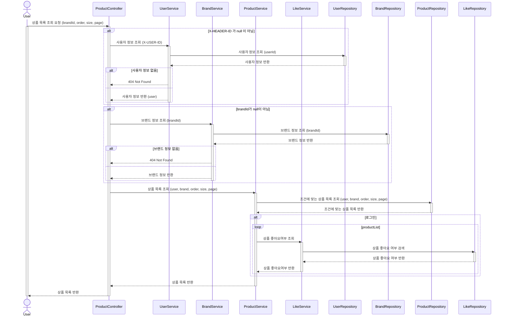

## 3. 상품 정보 조회

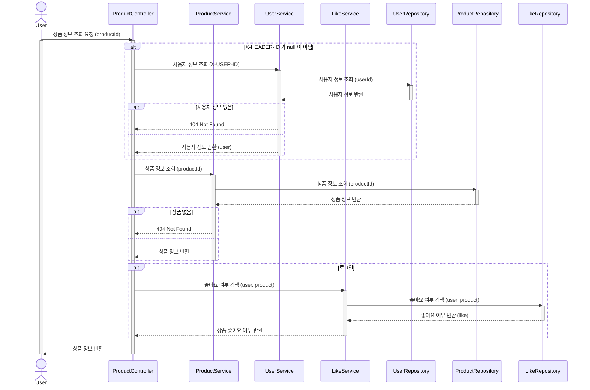

# ❤️ 좋아요 (Likes)

## 4. 상품 좋아요 등록

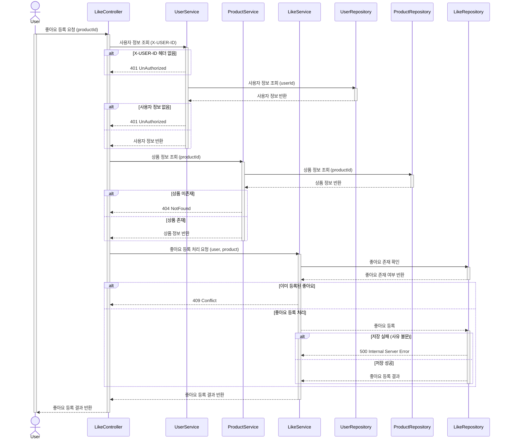

## 5. 상품 좋아요 취소

## 6. 내가 좋아요 한 상품 목록 조회

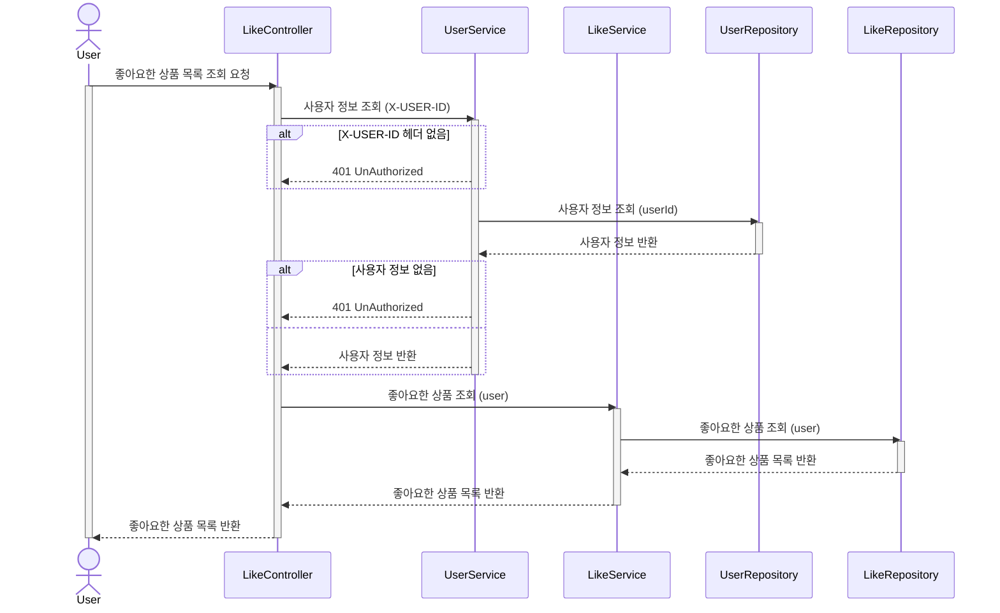

# 🛒 장바구니 (Carts)

## 7. 장바구니에 담기

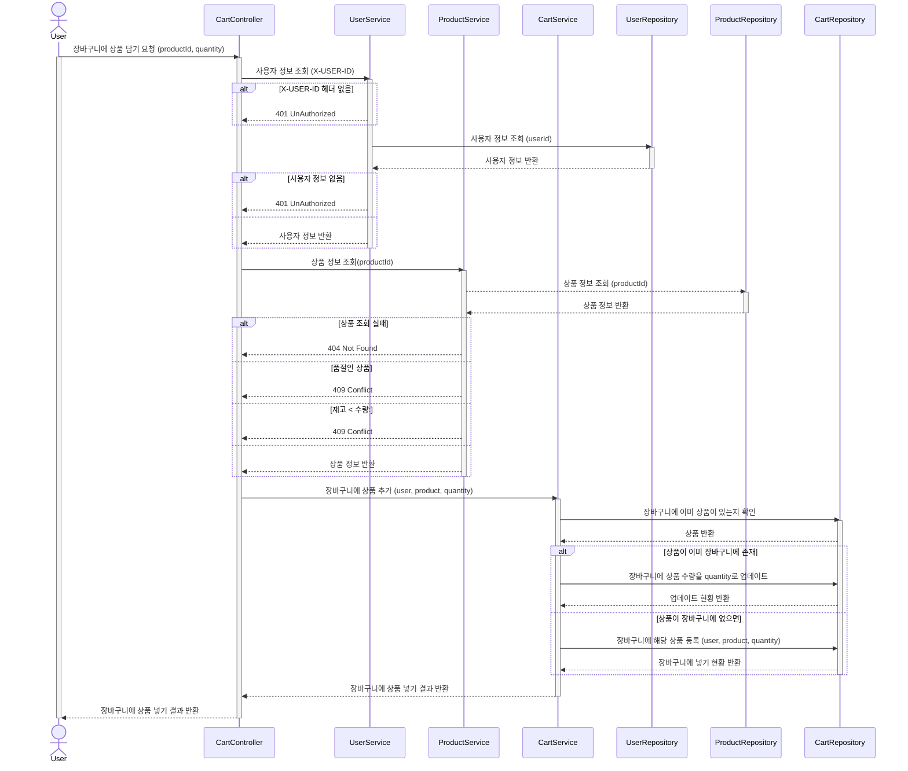

## 8. 장바구니에서 삭제

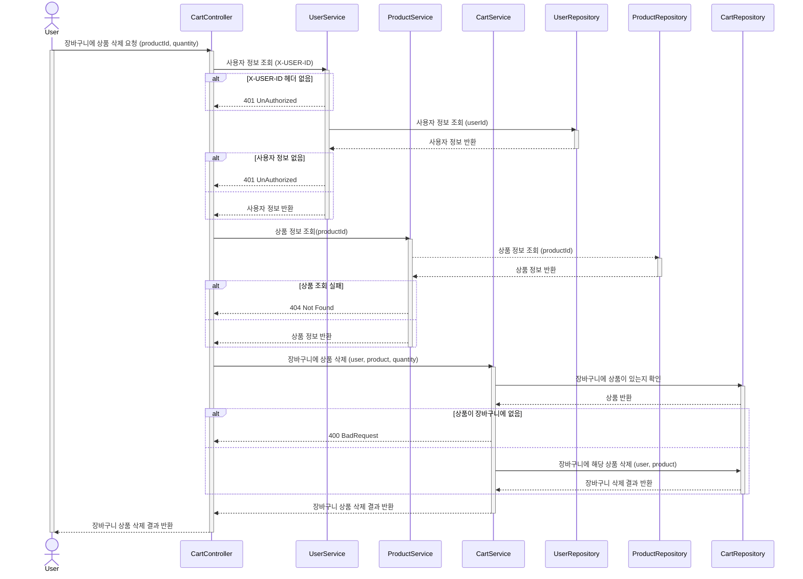

## 9. 장바구니 리스트 확인

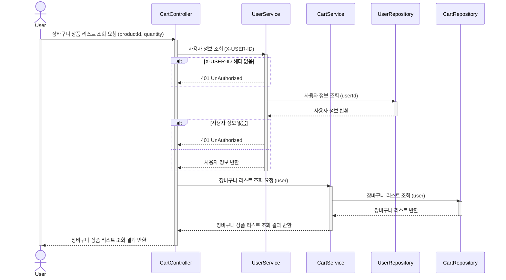

# 🧾 주문 / 결제 (Orders)

## 10. 주문 요청

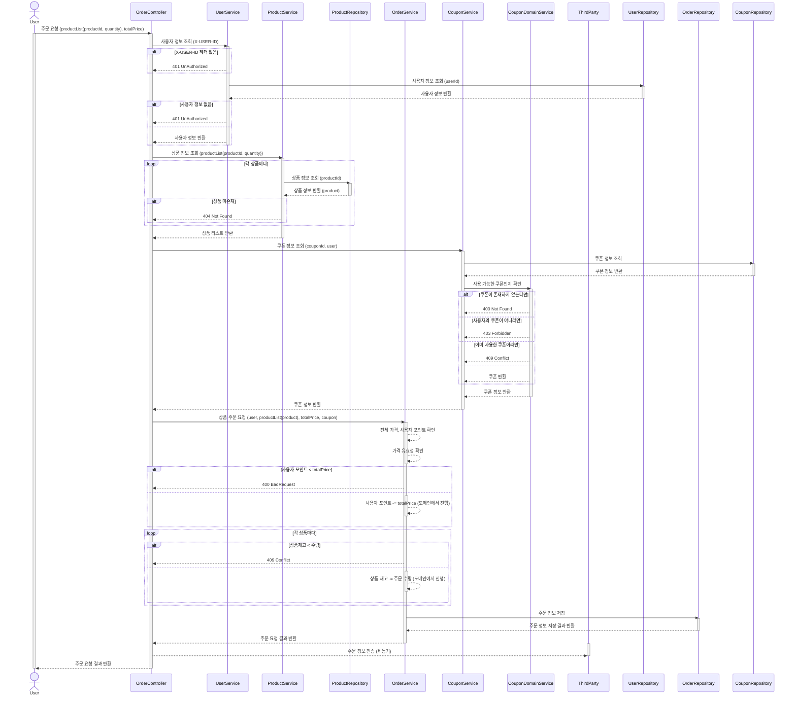

## 11. 유저의 주문 목록 조회

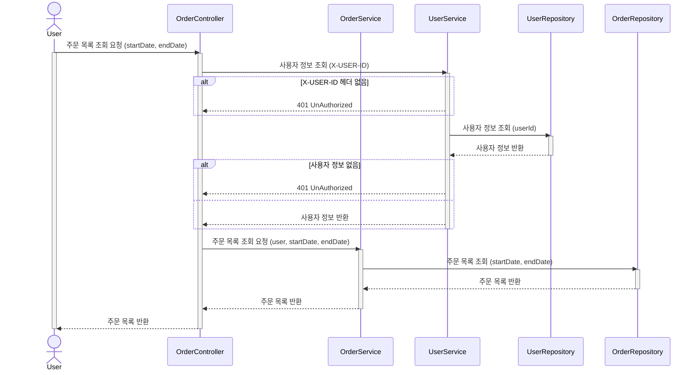

## 12. 단일 주문 상세 조회

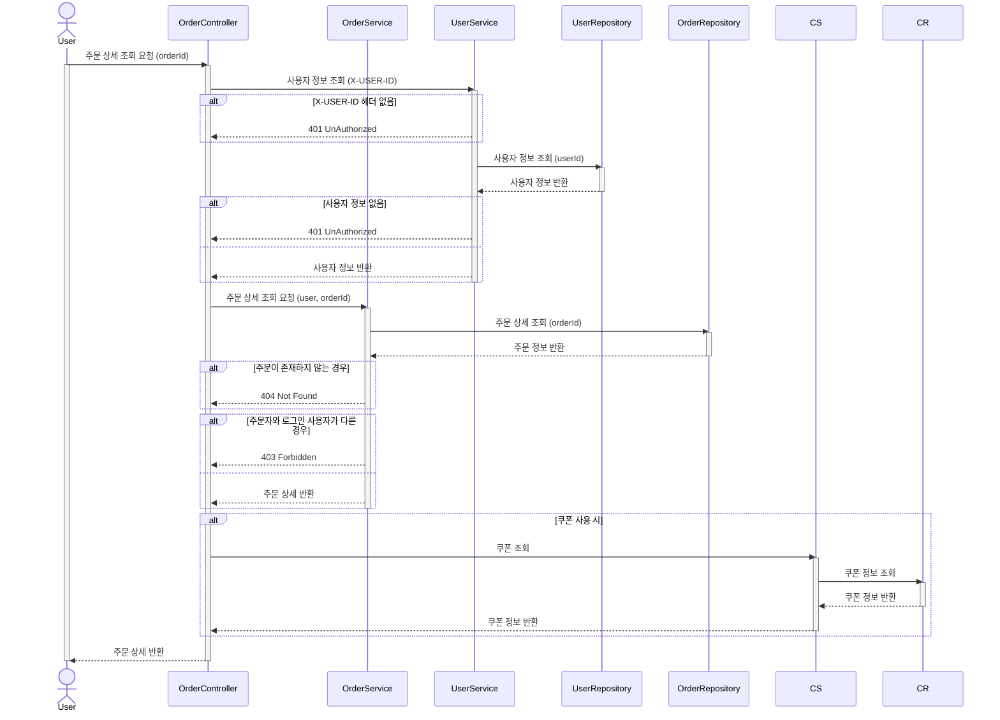

# 🏷️ 쿠폰 (Coupon)

## 13. 쿠폰 리스트 조회

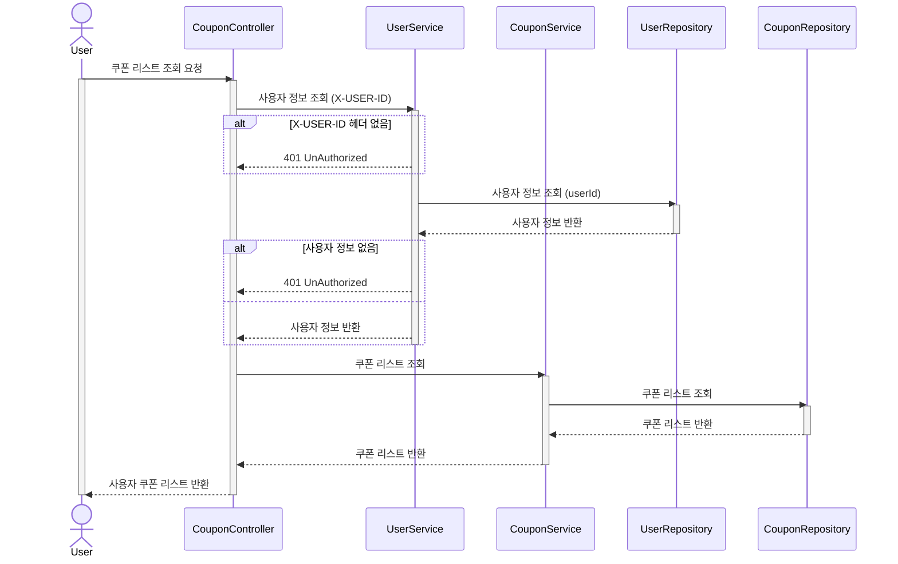
