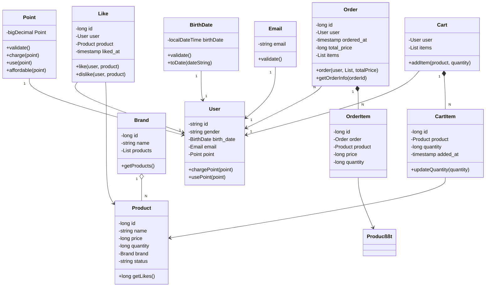

```mermaid
classDiagram
	class Email {
		-string email
		+validate()
	}
	class BirthDate {
		-localDateTime birthDate
		+validate()
		+toDate(dateString)
	}
	class Point {
		-bigDecimal Point
		+validate()
		+charge(point)
		+use(point)
		+affordable(point)
	}
	class User {
		-string id
		-string gender
		-BirthDate birth_date
		-Email email
		-Point point
		+chargePoint(point)
		+usePoint(point)
	}

	class Brand {
		-long id
		-string name
		-List<Product> products
		+getProducts()
	}

	class Product {
		-long id
		-string name
		-long price
		-long quantity
		-Brand brand
		-string status
		+long getLikes()
	}

	class Order {
		-long id
		-User user
		-timestamp ordered_at
		-long total_price
		-List<OrderItems> items
		+order(user, List<Product>, totalPrice)
		+getOrderInfo(orderId)
	}

	class OrderItem {
		-long id
		-Order order
		-Product product
		-long price
		-long quantity
	}

	class Cart {
		-User user
		-List<CartItem> items
		+addItem(product, quantity)
	}

	class CartItem {
		-long id
		-Product product
		-long quantity
		-timestamp added_at
		+updateQuantity(quantity)
	}

	class Like {
		-long id
		-User user
		-Product product
		-timestamp liked_at
		+like(user, product)
		+dislike(user, product)
	}

	%% Product
	Brand "1" o-- "N" Product
	Cart "1" *-- "N" CartItem
	CartItem --> Product
	Cart --> User

	%% Order
	Email "1" --> "1" User
	BirthDate "1" --> "1" User
	Point "1" --> "1" User
	Order "1" *-- "N" OrderItem
	OrderItem --> Producßßt
	Order "N" --> "1" User

	%% Like
	Like --> Product
	Like --> User

```
