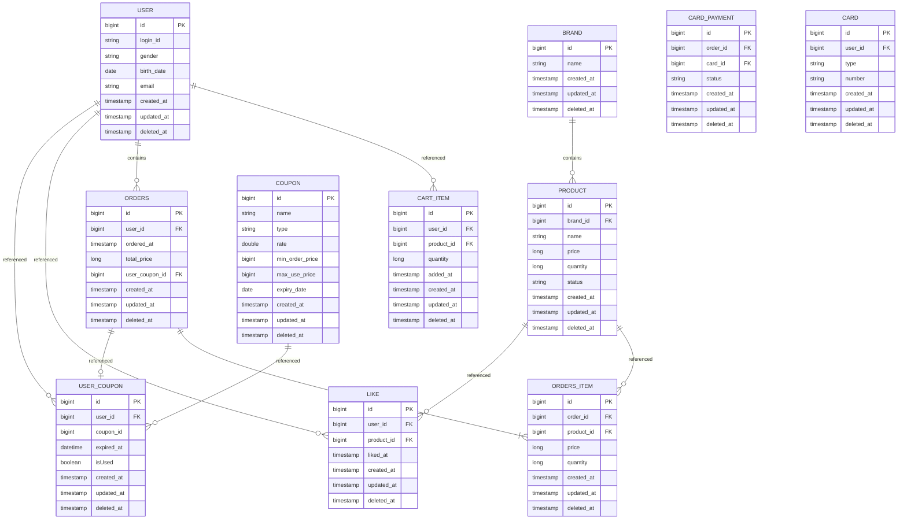

```mermaid
erDiagram
	USER {
		bigint id PK
		string login_id
		string gender
		date birth_date
		string email
		timestamp created_at
		timestamp updated_at
		timestamp deleted_at
	}

	BRAND {
		bigint id PK
		string name
		timestamp created_at
		timestamp updated_at
		timestamp deleted_at
	}

	PRODUCT {
		bigint id PK
		bigint brand_id FK
		string name
		long price
		long quantity
		string status
		timestamp created_at
		timestamp updated_at
		timestamp deleted_at
	}

	ORDERS {
		bigint id PK
		bigint user_id FK
		timestamp ordered_at
		long total_price
		bigint user_coupon_id FK
		timestamp created_at
		timestamp updated_at
		timestamp deleted_at
	}

	ORDERS_ITEM {
		bigint id PK
		bigint order_id FK
		bigint product_id FK
		long price
		long quantity
		timestamp created_at
		timestamp updated_at
		timestamp deleted_at
	}

	CART_ITEM {
		bigint id PK
		bigint user_id FK
		bigint product_id FK
		long quantity
		timestamp added_at
		timestamp created_at
		timestamp updated_at
		timestamp deleted_at
	}

	LIKE {
		bigint id PK
		bigint user_id FK
		bigint product_id FK
		timestamp liked_at
		timestamp created_at
		timestamp updated_at
		timestamp deleted_at
	}

	USER_COUPON {
		bigint id PK
		bigint user_id FK
		bigint coupon_id
		datetime expired_at
		boolean isUsed
		timestamp created_at
		timestamp updated_at
		timestamp deleted_at
	}

	COUPON {
		bigint id PK
		string name
		string type
		double rate
		bigint min_order_price
		bigint max_use_price
		date expiry_date
		timestamp created_at
		timestamp updated_at
		timestamp deleted_at
	}

	CARD_PAYMENT {
		bigint id PK
		bigint order_id FK
		bigint card_id FK
		string status
		timestamp created_at
		timestamp updated_at
		timestamp deleted_at
	}

	CARD {
		bigint id PK
		bigint user_id FK
		string type
		string number
		timestamp created_at
		timestamp updated_at
		timestamp deleted_at
	}


	BRAND ||--o{ PRODUCT : contains
	ORDERS ||--|{ ORDERS_ITEM : contains
	PRODUCT ||--o{ ORDERS_ITEM : referenced
	USER ||--o{ CART_ITEM : referenced
	USER ||--o{ ORDERS : contains
	USER ||--o{ LIKE : referenced
	PRODUCT ||--o{ LIKE : referenced
	ORDERS ||--o| USER_COUPON : referenced
	COUPON ||--o{ USER_COUPON: referenced
	USER ||--o{ USER_COUPON: referenced
```
